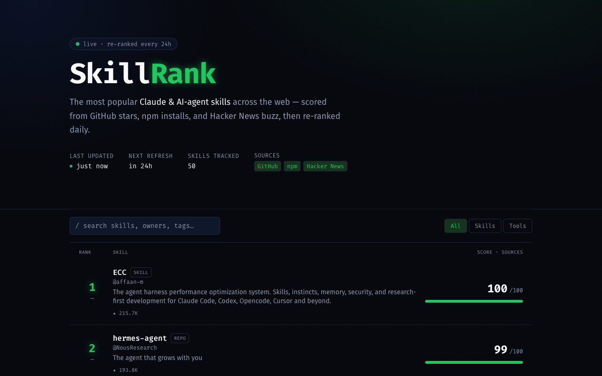

# SkillRank


**A daily leaderboard of the most popular Claude Code & AI-agent skills**, scored from signals across the open web and re-ranked every 24 hours — so it's worth coming back to.

🟢 `live · re-ranked every 24h` — **[skill-rank-ten.vercel.app](https://skill-rank-ten.vercel.app)**

<p align="center">
  
</p>

## What it does

SkillRank discovers Claude / AI-agent skills (skills, subagents, MCP servers, and curated collections) and ranks them by a transparent **0–100 popularity score** built from three independent sources:

| Source | Signals | Weight |
| --- | --- | --- |
| **GitHub** | stars, forks, recency (days since last push) | 0.58 |
| **npm** | weekly downloads | 0.25 |
| **Hacker News** | story points + comment buzz, mention count | 0.17 |

Each signal is **log-scaled and normalized** across the field so a handful of mega-repos don't flatten everything below them. Every row shows a coloured **source-mix bar** so you can see *where* a skill's popularity comes from, plus a **▲/▼ movement badge** versus yesterday's snapshot.

### Keeping it on-topic

Broad web searches drag in general AI tooling, so every live candidate passes a **relevance gate** (`lib/relevance.ts`) before ranking:

- **Allowlist** — must mention a Claude / agent-skill term (`claude`, `anthropic`, `mcp`, `subagent`, `agent-skill`, `agentic`, `claude-code`, …) across its name/description/tags.
- **Denylist** — a small curated set of repos that pass the term gate but aren't *skills* (standalone automation platforms like n8n, rival-vendor CLIs that self-tag with `mcp`/`ai-agents`). Add offenders to `EXCLUDE_KEY_PATTERNS` as they surface.

## How the daily re-rank works

- **Source responses** are fetched with Next.js' Data Cache (`revalidate: 86400`, tagged `skills`).
- **The page** is statically rendered and revalidated every 24h (`export const revalidate`).
- **A Vercel Cron** hits `/api/cron/refresh` daily (`0 0 * * *`, see `vercel.json`), which calls `revalidateTag("skills")` to drop the cached source data, recomputes, and stores a snapshot for movement arrows.
- If every live source is unreachable, the board falls back to a **curated seed set** (`lib/seed.ts`) so it's never empty — flagged with a banner.

## Architecture

```
app/
  page.tsx                 server component, revalidate=86400, renders the board
  layout.tsx               Fira Code/Sans, metadata, OG tags
  icon.svg                 favicon (animated ranking-bars mark)
  api/skills/route.ts      public JSON feed of the current ranking
  api/cron/refresh/route.ts daily refresh (CRON_SECRET-protected)
components/
  Hero.tsx                 "last updated" hero, live pulse, source pills
  Leaderboard.tsx          client: search + kind filter
  SkillRow.tsx             rank, movement, score, source-mix bar
  TimeAgo.tsx              client-resolved relative time
lib/
  sources/{github,npm,hackernews}.ts   one resilient fetcher per source
  rank.ts                  pure scoring/merge engine (unit-tested)
  skills.ts                orchestrator: gather → merge → rank → movement
  snapshot.ts              optional Supabase REST snapshots for movement
  seed.ts                  curated offline fallback
  format.ts / types.ts
```

## Getting started

```bash
npm install
npm run dev        # http://localhost:3000
npm test           # vitest — ranking engine
npm run lint
npm run build
```

The app runs **with zero configuration** — it'll fetch live data and, if rate-limited or offline, show the seed set.

## Configuration

All env vars are optional (`.env.example`):

| Variable | Purpose |
| --- | --- |
| `GITHUB_TOKEN` | Raises the GitHub search rate limit (~10 → ~30 req/min). Public-search token, no scopes needed. |
| `CRON_SECRET` | Protects `/api/cron/refresh`. Set the same value in Vercel; Cron sends it as `Authorization: Bearer …`. |
| `NEXT_PUBLIC_SUPABASE_URL` + `SUPABASE_SERVICE_ROLE_KEY` | Enable day-over-day **movement arrows** by persisting daily snapshots. Omit to disable. |

### Movement snapshots (optional)

Create one table in Supabase:

```sql
create table skill_snapshots (
  id         bigint generated always as identity primary key,
  created_at timestamptz not null default now(),
  ranks      jsonb not null
);
create index on skill_snapshots (created_at desc);
```

Without it, the board still re-ranks daily — rows just won't show ▲/▼ arrows.

## Deploy (Vercel)

1. Import the repo into Vercel.
2. (Optional) add the env vars above.
3. Deploy. `vercel.json` registers the daily cron automatically.

## Tech

Next.js 16 · React 19 · Tailwind CSS v4 · TypeScript · Vitest. Dark "ops terminal" UI (Fira Code/Sans, OLED palette, source-mix bars).

## Contributing

Contributions are welcome! Please open an issue first to discuss what you'd like to change.

1. Fork the repo
2. Create a feature branch (`git checkout -b feature/your-feature`)
3. Commit your changes (`git commit -m 'feat: describe change'`)
4. Push and open a pull request

Please make sure `npm test` and `npm run lint` pass before submitting a PR.

## Code of Conduct

This project follows the [Contributor Covenant v2.1](https://www.contributor-covenant.org/version/2/1/code_of_conduct/).
By participating you agree to uphold a welcoming, harassment-free environment.

## License

Distributed under the MIT License. See [LICENSE](LICENSE) for details.
